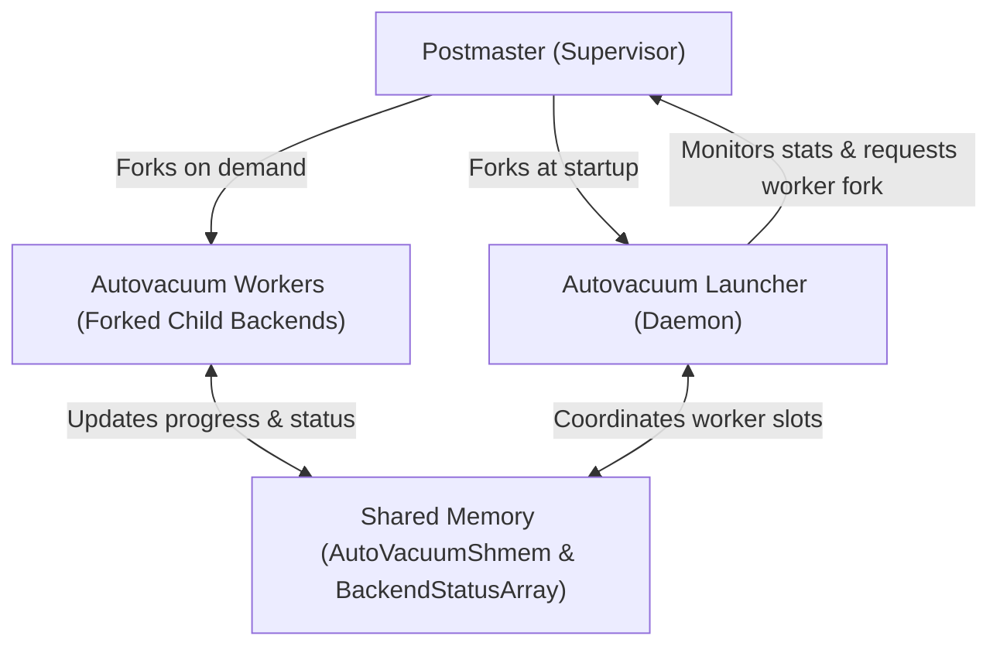
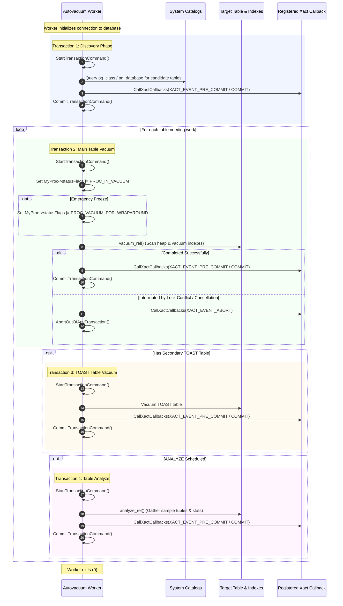

# PostgreSQL Autovacuum Architecture and Telemetry Hooks

This document details the process execution lifecycle of PostgreSQL's autovacuum subsystem, the internal transaction structure of autovacuum workers, hook availability, and mechanisms for emitting OpenTelemetry data for autovacuum operations.

---

## Subsystem Architecture & Process Lifecycle

PostgreSQL handles automated dead-tuple cleanup and catalog statistics updates via two cooperating process roles:



1. **Autovacuum Launcher** (`MyBackendType == B_AUTOVAC_LAUNCHER`):
   * Long-lived daemon process started by Postmaster.
   * Periodically wakes up (`autovacuum_naptime`), checks catalog statistics in each database, and signals Postmaster when worker slots are needed.
2. **Autovacuum Workers** (`MyBackendType == B_AUTOVAC_WORKER`):
   * Ephemeral backend processes forked by Postmaster upon launcher request.
   * Connects to a specific database, builds a list of candidate tables, and runs vacuum/analyze passes.
   * **Bypasses SQL Engine**: Autovacuum workers do **not** parse or plan queries. They invoke internal C routines (`do_autovacuum()` $\rightarrow$ `vacuum()` / `vac_table()`) directly.

---

## Worker Transaction Lifecycle

An autovacuum worker does not execute within a single monolithic transaction. Instead, it segments its operations across multiple discrete top-level transactions:



---

## Hook Availability in Autovacuum Workers

Because autovacuum workers are PostgreSQL backend processes that inherit loaded dynamic libraries from Postmaster, extension code runs within their memory space.

### Transaction Callback (`RegisterXactCallback`)

PostgreSQL provides `RegisterXactCallback(XactCallback callback, void *arg)` to listen to transaction boundary events.

#### Start vs. End Event Limitation
* `XactEvent` only includes end-of-transaction events:
  * `XACT_EVENT_PRE_COMMIT`
  * `XACT_EVENT_COMMIT`
  * `XACT_EVENT_ABORT`
  * `XACT_EVENT_PREPARE`
* **There is no `XACT_EVENT_START`** in PostgreSQL for top-level transactions. Extensions cannot synchronously intercept the moment a vacuum transaction starts.

#### Retroactive Span Generation
Although start events are unavailable, PostgreSQL records transaction start timestamps in memory:
* `GetCurrentTransactionStartTimestamp()` returns the exact `TimestampTz` when the transaction began.
* At `XACT_EVENT_PRE_COMMIT` or `XACT_EVENT_ABORT`, the extension can calculate total duration:
  $$\text{duration} = \text{GetCurrentTimestamp}() - \text{GetCurrentTransactionStartTimestamp}()$$
* This enables constructing and emitting a completed span retroactively upon commit or abort.

#### Inspectable State During Callbacks

When the transaction callback executes, the following runtime state is accessible:

| Field / Function | Scope | Description |
| :--- | :--- | :--- |
| `MyBackendType == B_AUTOVAC_WORKER` | Process | Confirms the callback is running inside an autovacuum worker (macro `AmAutoVacuumWorkerProcess()`). |
| `MyProc->statusFlags & PROC_IN_VACUUM` | `XACT_EVENT_PRE_COMMIT`<br>`XACT_EVENT_ABORT` | Distinguishes actual table vacuum transactions from setup/catalog discovery transactions. |
| `MyProc->statusFlags & PROC_VACUUM_FOR_WRAPAROUND` | `XACT_EVENT_PRE_COMMIT`<br>`XACT_EVENT_ABORT` | Indicates an emergency vacuum run to prevent Transaction ID (XID) or MultiXact wraparound. |
| `MyBEEntry->st_progress_command_target` | Shared Memory | Holds the relation `Oid` currently being vacuumed (set via `pgstat_progress_start_command(PROGRESS_COMMAND_VACUUM, relid)`). |
| `XACT_EVENT_ABORT` | Callback Event | Emitted when autovacuum is canceled due to lock timeout or deadlocks against client transactions. |

> [!NOTE]
> `MyProc->statusFlags` vacuum bits (`PROC_VACUUM_STATE_MASK`) are cleared inside `ProcArrayEndTransaction()`. Therefore, `PROC_IN_VACUUM` must be checked during `XACT_EVENT_PRE_COMMIT` or `XACT_EVENT_ABORT`, as it will be cleared by the time `XACT_EVENT_COMMIT` runs.

---

### Diagnostic Log Hook (`emit_log_hook`)

Whenever PostgreSQL logs messages via `ereport()` or `elog()`, `emit_log_hook` is called inside the autovacuum worker:

- When a client query forces an autovacuum worker to cancel (due to lock timeout or deadlock), PostgreSQL explicitly sets the error context before reporting:
  ```c
  errcontext("automatic vacuum of table \"%s.%s.%s\"",
             tab->at_datname, tab->at_nspname, tab->at_relname);
  EmitErrorReport();
  ```
  `emit_log_hook` receives the fully-assembled `ErrorData` struct with `edata->context` containing the exact database, schema, and table name.
- When `log_autovacuum_min_duration >= 0` and runtime exceeds the threshold, autovacuum emits a detailed `LOG` entry containing:
  * Elapsed CPU and wall-clock duration
  * Dead and live tuples removed
  * Buffer hit, read, and dirtied metrics
  * WAL written
