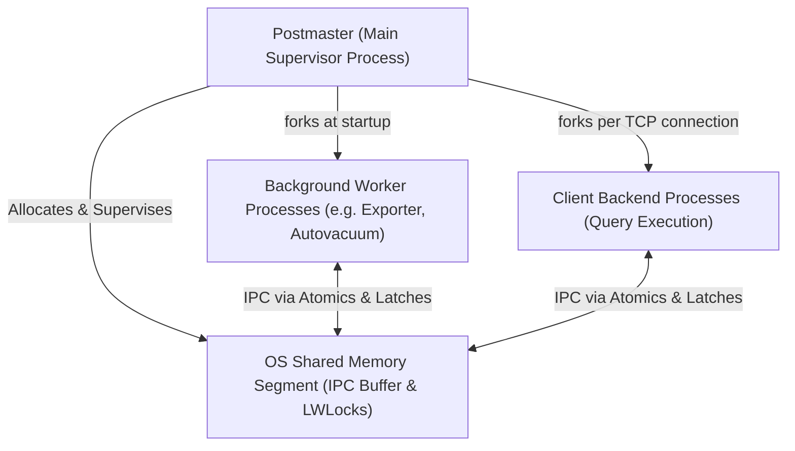
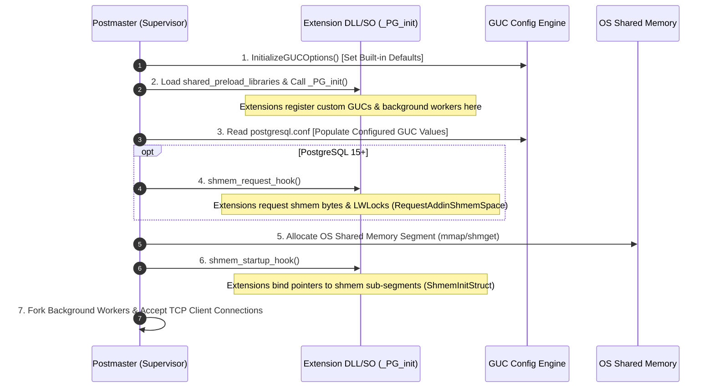
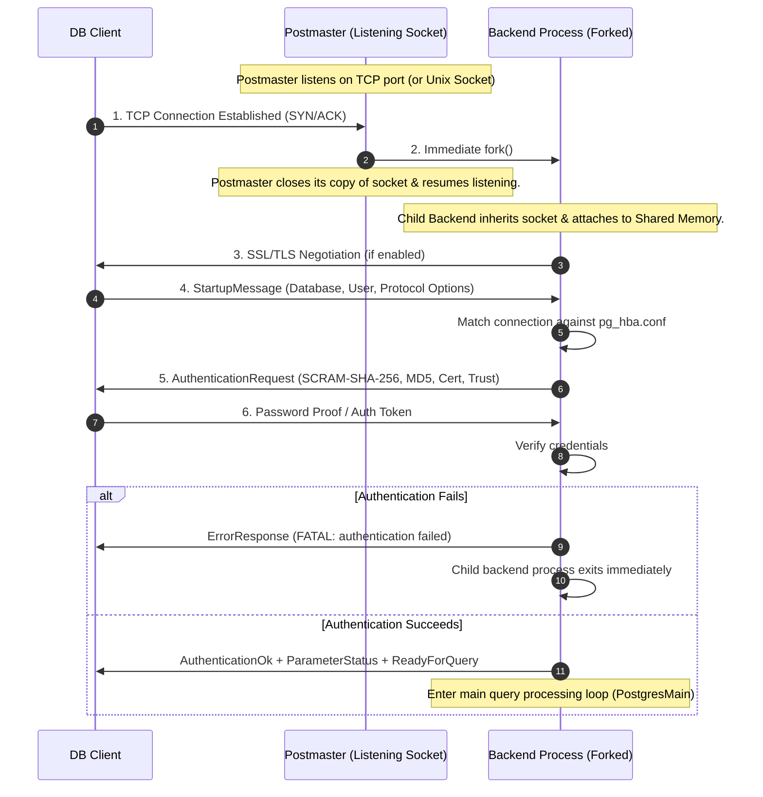
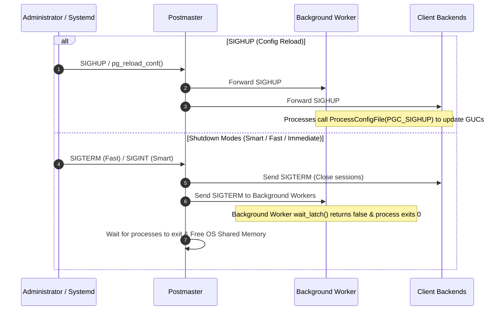

# PostgreSQL Architecture and Process Lifecycles

This document serves as a technical reference for PostgreSQL's multi-process supervisor model, process execution lifecycles, extension shared-memory initialization, signal handling, and shutdown procedures.

---

## Architecture Overview

PostgreSQL uses a **multi-process model** centered around a main supervisor process called **Postmaster**.

---

## 1. Postmaster Startup and Shared Memory

Postmaster initializes state, parses configuration files, allocates shared memory, and loads C extensions specified in `shared_preload_libraries`.

### Startup Sequence Diagram

### General Extension Hook Points at Startup

* **`_PG_init()`**: Called by Postmaster immediately when the extension's dynamic library is loaded. Extensions use this entrypoint to define custom GUC variables (`DefineCustomIntVariable`), register background workers (`RegisterBackgroundWorker`), and set up hook function pointers.
* **`shmem_request_hook` _(PG15+)_**: Executed during Postmaster shared memory size estimation, **before** OS memory allocation. Extensions call `RequestAddinShmemSpace(bytes)` and `RequestNamedLWLockTranche()` here. *(In PG13/14, `RequestAddinShmemSpace` was called in `_PG_init`)*.
* **`shmem_startup_hook`**: Executed after OS shared memory is allocated. Extensions call `ShmemInitStruct("name", size, &mut found)` to initialize or attach to their shared memory structures.

---

## 2. Client Connection and Authentication

When a client connects, Postmaster immediately forks a dedicated **Backend Process**.

---

## 3. Signal Handling, Configuration Reloads, and Shutdown

PostgreSQL processes communicate shutdown requests and configuration reloads via UNIX signals and Latch primitives.

### Latch Synchronization (`WaitLatch` / `SetLatch`)

In PostgreSQL's process architecture, background workers sleep using `WaitLatch()`. When another process (a backend or Postmaster) needs to wake up the worker, it calls `SetLatch(&worker->latch)`. This provides a zero-overhead, event-driven sleeping and waking mechanism without polling.

### Shutdown & Signal Handling Diagram

### PostgreSQL Shutdown Modes

| Shutdown Mode | Signal | Behavior |
| :--- | :--- | :--- |
| **Smart Shutdown** | `SIGINT` | Disallows new connections; waits for existing client sessions and background workers to finish. |
| **Fast Shutdown** _(Default)_ | `SIGTERM` | Terminates active client sessions, rolls back active transactions, signals background workers, and shuts down immediately. |
| **Immediate Shutdown** | `SIGQUIT` | Postmaster terminates all child processes immediately without clean shutdown, requiring crash recovery on next startup. |

### PostgreSQL Shutdown Phase Ordering

During server shutdown (`Fast` or `Smart`), PostgreSQL manages process termination in distinct phases to ensure data integrity:

1. **Phase 1**: `PM_WAIT_BACKENDS`
   * Postmaster sends `SIGTERM` to all **client backends**, **autovacuum launcher/workers**, **parallel query workers**, and custom **background workers**.
   * Postmaster waits for all Phase 1 processes to exit.
2. **Phase 2**: `PM_SHUTDOWN`
   * Postmaster intentionally keeps auxiliary processes (**checkpointer**, **background writer**, **WAL writer**) running throughout Phase 1 so those backends and workers can finish logging WAL and flushing pages.
   * Postmaster signals auxiliary processes to execute the final shutdown checkpoint and exit **only after all Phase 1 processes have exited**.
