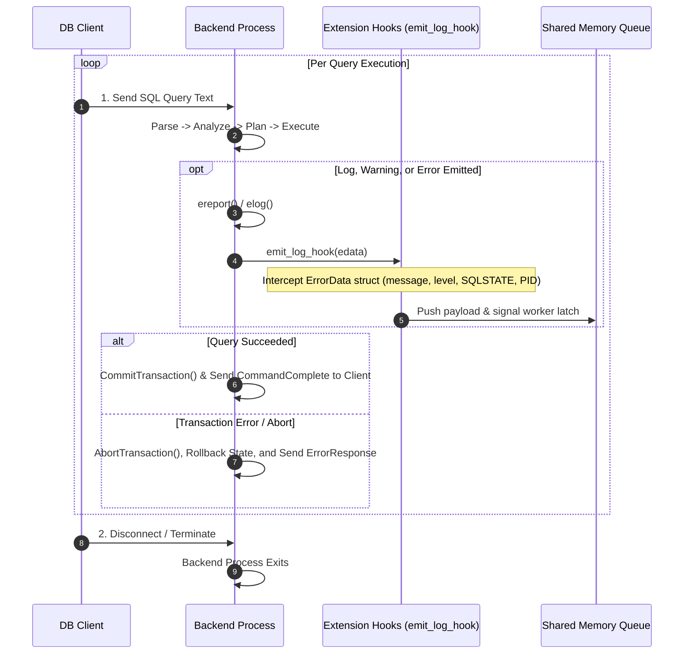

# PostgreSQL Query Processing and SQL Hook Execution Matrix

This document provides a technical reference for query execution lifecycles, diagnostic error/log hooks, and the exact invocation sequence of extension hooks across SQL commands.

---

## Query Processing & Diagnostic Hooks

### Backend Lifecycles & Diagnostic Hooks

* **Query Lifecycle**: Queries transition through `Parse` $\rightarrow$ `Analyze` $\rightarrow$ `Plan` $\rightarrow$ `Execute` $\rightarrow$ `Commit`/`Abort`.
* **`emit_log_hook`**: Executed whenever PostgreSQL's internal `ereport()` or `elog()` macros write a log, warning, error, or debug message. Extensions can inspect or suppress `ErrorData` fields (e.g. SQLSTATE, error message, severity, line number).
* **Transaction Aborts**: (`ERROR` / `FATAL`) When a transaction fails, PostgreSQL aborts the transaction and rolls back database state. Shared memory writes (IPC queues) are independent of database transaction rollbacks and remain intact.
* **Backend Crashes**: (SIGSEGV / Panic) If a backend process crashes, Postmaster catches `SIGCHLD`, sends `SIGQUIT` to all other backends to stop execution, resets shared memory, and runs crash recovery.

---

## SQL Hook Execution Matrix

The following tables map each SQL command to the hooks it triggers. Numbers indicate the order hooks are called, while a dash indicates the hook is not called.

### Utility Commands

These trigger `post_parse_analyze_hook`, `process_utility_hook`, and `xact_callback`.

| SQL Command | `post_parse_analyze_hook` | `process_utility_hook` | `planner_hook` | `executor_start_hook` | `executor_run_hook` | `xact_callback` |
| :---------- | :-----------------------: | :--------------------: | :------------: | :-------------------: | :-----------------: | :-------------: |
| **ALTER …**                   | 1 | 2 | - | - | - | 3 |
| **ANALYZE**                   | 1 | 2 | - | - | - | 3 |
| **CALL**                      | 1 | 2 | - | - | - | 3 |
| **CLOSE**                     | 1 | 2 | - | - | - | 3 |
| **CLUSTER**                   | 1 | 2 | - | - | - | 3 |
| **COMMENT**                   | 1 | 2 | - | - | - | 3 |
| **DISCARD**                   | 1 | 2 | - | - | - | 3 |
| **DO**                        | 1 | 2 | - | - | - | 3 |
| **DROP …**                    | 1 | 2 | - | - | - | 3 |
| **GRANT**                     | 1 | 2 | - | - | - | 3 |
| **IMPORT FOREIGN SCHEMA**     | 1 | 2 | - | - | - | 3 |
| **LISTEN**                    | 1 | 2 | - | - | - | 3 |
| **LOAD**                      | 1 | 2 | - | - | - | 3 |
| **LOCK**                      | 1 | 2 | - | - | - | 3 |
| **MOVE**                      | 1 | 2 | - | - | - | 3 |
| **NOTIFY**                    | 1 | 2 | - | - | - | 3 |
| **REASSIGN OWNED**            | 1 | 2 | - | - | - | 3 |
| **REINDEX**                   | 1 | 2 | - | - | - | 3 |
| **RESET**                     | 1 | 2 | - | - | - | 3 |
| **REVOKE**                    | 1 | 2 | - | - | - | 3 |
| **SECURITY LABEL**            | 1 | 2 | - | - | - | 3 |
| **SET**                       | 1 | 2 | - | - | - | 3 |
| **SET CONSTRAINTS**           | 1 | 2 | - | - | - | 3 |
| **SET ROLE**                  | 1 | 2 | - | - | - | 3 |
| **SET SESSION AUTHORIZATION** | 1 | 2 | - | - | - | 3 |
| **SHOW**                      | 1 | 2 | - | - | - | 3 |
| **TRUNCATE**                  | 1 | 2 | - | - | - | 3 |
| **UNLISTEN**                  | 1 | 2 | - | - | - | 3 |
| **VACUUM**                    | 1 | 2 | - | - | - | 3 |

### Transaction Commands

Transaction statements bypass `post_parse_analyze_hook` and execute directly via `process_utility_hook`.

| SQL Command | `post_parse_analyze_hook` | `process_utility_hook` | `planner_hook` | `executor_start_hook` | `executor_run_hook` | `xact_callback` |
| :---------- | :-----------------------: | :--------------------: | :------------: | :-------------------: | :-----------------: | :-------------: |
| **ABORT**               | - | 1 | - | - | - | 2 |
| **BEGIN**               | - | 1 | - | - | - | 2 |
| **CHECKPOINT**          | - | 1 | - | - | - | 2 |
| **COMMIT …**            | - | 1 | - | - | - | 2 |
| **END**                 | - | 1 | - | - | - | 2 |
| **PREPARE TRANSACTION** | - | 1 | - | - | - | 2 |
| **RELEASE SAVEPOINT**   | - | 1 | - | - | - | 2 |
| **ROLLBACK …**          | - | 1 | - | - | - | 2 |
| **SAVEPOINT**           | - | 1 | - | - | - | 2 |
| **SET TRANSACTION**     | - | 1 | - | - | - | 2 |
| **START TRANSACTION**   | - | 1 | - | - | - | 2 |

### DML and Queries

| SQL Command | `post_parse_analyze_hook` | `process_utility_hook` | `planner_hook` | `executor_start_hook` | `executor_run_hook` | `xact_callback` |
| :---------- | :-----------------------: | :--------------------: | :------------: | :-------------------: | :-----------------: | :-------------: |
| **COPY … FROM**               | 1 | 2 | - | - | - | 3 |
| **COPY … TO**                 | 1 | 2 | - | - | - | 3 |
| **COPY (query) TO**           | 1 | 2 | 3 | 4 | 5 | 6 |
| **CREATE …**                  | 1 | 2 | - | - | - | 3 |
| **CREATE MATERIALIZED VIEW**  | 1 | 2 | 3 | 4 | 5 | 6 |
| **CREATE TABLE AS**           | 1 | 2 | 3 | 4 | 5 | 6 |
| **CREATE VIEW**               | 1 | 2 | - | - | - | 3 |
| **DEALLOCATE**                | 1 | 2 | - | - | - | 3 |
| **DECLARE**                   | 1 | 2 | 3 | 4 | - | 5 |
| **DELETE**                    | 1 | - | 2 | 3 | 4 | 5 |
| **EXECUTE**                   | 1 | 2 | - (cached) | 3 | 4 | 5 |
| **EXPLAIN**                   | 1 | 2 | 3 | 4 | - | 5 |
| **EXPLAIN (ANALYZE)**         | 1 | 2 | 3 | 4 | 5 | 6 |
| **FETCH**                     | 1 | 2 | - | - | 3 | 4 |
| **INSERT**                    | 1 | - | 2 | 3 | 4 | 5 |
| **MERGE**                     | 1 | - | 2 | 3 | 4 | 5 |
| **PREPARE**                   | 1 | 2 | - | - | - | 3 |
| **REFRESH MATERIALIZED VIEW** | 1 | 2 | 3 | 4 | 5 | 6 |
| **SELECT**                    | 1 | - | 2 | 3 | 4 | 5 |
| **SELECT INTO**               | 1 | 2 | 3 | 4 | 5 | 6 |
| **UPDATE**                    | 1 | - | 2 | 3 | 4 | 5 |
| **VALUES**                    | 1 | - | 2 | 3 | 4 | 5 |
